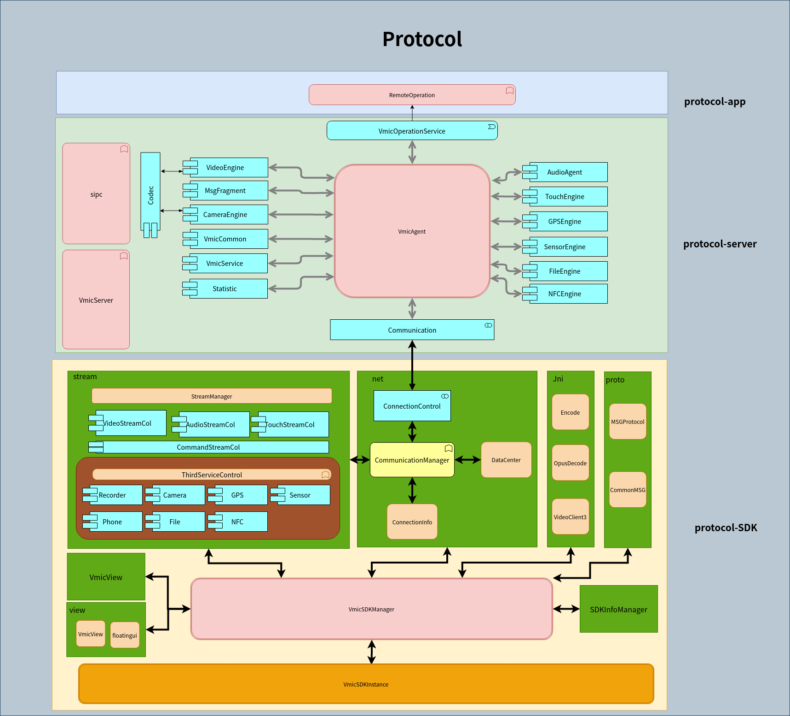
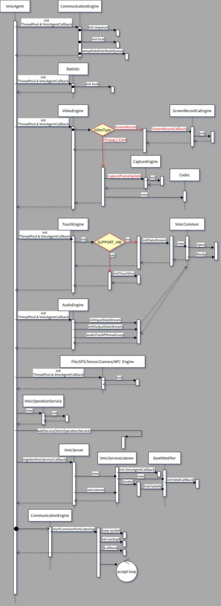
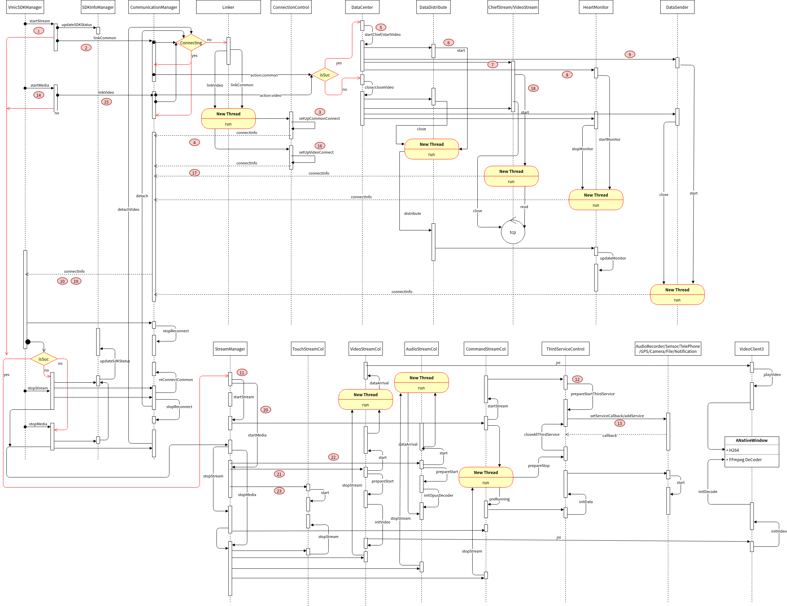
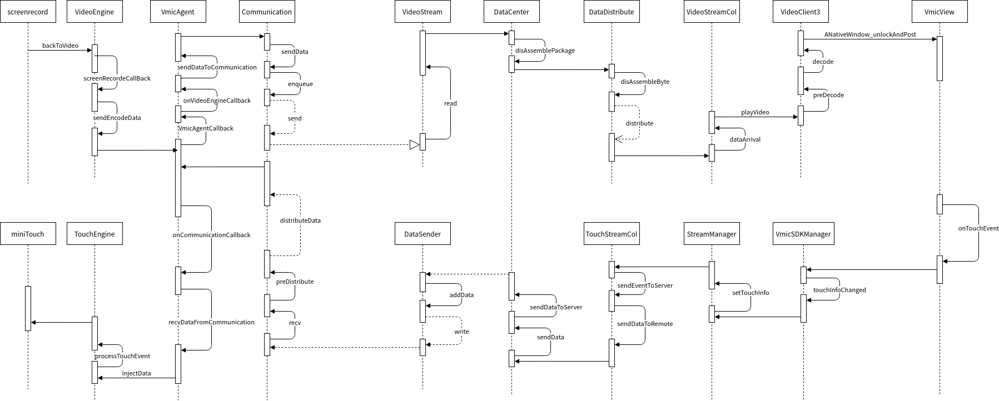

# 协议概述
如下为协议的全局示意图



如图，整个协议分为三个部分

1. protocol-app
2. protocol-server
3. protocol-SDK

## 1、protocol-app
这部分为一个app，接收开机广播启动，它的目地在于处理Android上层的逻辑，如收发广播，监听通知，更新数据库等。下面为这部分的主要构成及其功能。
### 1.1、OperationMonitor
整个apk的核心，当收到开机广播会被启动。主要功能：
1. 注册协议业务所需要的广播
```java
cmcc.intent.action.CALL //拨打电话
cmcc.intent.action.SEND_MESSAGE //发送短信
android.location.MODE_CHANGED  //GPS 开关
cmcc.intent.action.file.download //文件下载
```
2. 初始化协议环境
```java
BusinessControl.getInstance().setContext(mContext);
BusinessControl.getInstance().setServerHandler(mServerHandler);
OperateStreamControl.getInstance().setContext(mContext);

//注册Rotation的监听
mContext.getContentResolver().registerContentObserver(Settings.System.getUriFor(Settings.System.ACCELEROMETER_ROTATION),
                false, mAccRotationObserver);
```
3. 与**protocol-server**建立binder通信，其逻辑在**protocol::OperateStreamControl**里面，它最终binder到的对象就是图中**protocol-server**的VmicOperationService
```java
IOperationService operationService = null;
        try {
            Class<?> serviceManager = Class.forName("android.os.ServiceManager");
            Method method = serviceManager.getDeclaredMethod("getService", String.class);
            IBinder binder = (IBinder) method.invoke(null, Constants.OPERATION_SERVICE_NAME);
            if (binder != null) {
                operationService = IOperationService.Stub.asInterface(binder);
                if (operationService != null) {
                    if (Constants.DEBUG) {
                        Log.d(TAG, "[getOperationService]connect native service(VmicOperation) successed !");
                    }
                }
                binder.linkToDeath(deathRecipient, 0);//death机制，做重连
            }
        } catch (ClassNotFoundException | NoSuchMethodException e) {
            e.printStackTrace();
        } catch (IllegalAccessException e) {
            e.printStackTrace();
        } catch (InvocationTargetException e) {
            e.printStackTrace();
        } catch (RemoteException e) {
            e.printStackTrace();
        }
```
### 1.2、businessimpl::BusinessControl
协议业务具体实现的管理者。负责各业务的初始化，数据管理与分发包括广播的收发以及作为与**protocol-server**沟通的桥梁。


## 2、protocol-server
此为协议的主体，由三个进程（sipc、VmicService、VmicAgent）和一个service组成，它的目的在于与上层app、HAL层虚拟化部分、SDK沟通并行使相应的功能。
### 2.1、sipc
这部分是一个共享内存模块，其作用是作为HAL下Audio、Camera、Sensor、GPS提供与VmicAgent的数据互通。
### 2.2、VmicServer
这模块是针对协议的功能，开了相应的port去动态开启debug开关，实例相对应的debug端口如下：
```bash
ip：116.63.233.87
port:(instance-1)*5+10000
debug:port+2
```

eg:终端输入下列命令(配置公有云实例5的debug开关)

    telnet 116.63.233.87 10022

显示如下：
```bash
Trying 116.63.233.87...
Connected to 116.63.233.87.
Escape character is '^]'.

Help:
1.debugLevel:
  1).agent 1
  2).communication 2
  3).video 4
  4).audio 8
  5).touch 16
  6).operator 32

```
如上：输入1则Agent的debug打开，2为通信模块的debug打开，如果为3则为Agent和通信的一起打开，输入255就是把所有的debug全部打开。输入形式如下：
```bash
debugLevel:255
```
最终会给你一个返回，当收到如下形式，则为设置debug成功。
```bash
Trying 116.63.233.87...
Connected to 116.63.233.87.
Escape character is '^]'.

Help:
1.debugLevel:
  1).agent 1
  2).communication 2
  3).video 4
  4).audio 8
  5).touch 16
  6).operator 32
debugLevel:255

set succeed
Connection closed by foreign host.
```

### 2.3、protocol
这部分是协议核心处理类，它负责各业务的初始化，数据分发，状态管理，用户控制和业务控制。

## 3、protocol-SDK
它客户端的核心，配合协议server完成相应的功能。

## 4、各组件介绍

server端

0. VmicAgent：整个server的控制管理
1. VideoEngine：负责视频部分的采集
2. Codec：负责视频的编码和相机的解码
3. AudioEngine：负责音频的采集和录音的注入
4. MsgFragment：负责协议数据的打包与拆包
5. TouchEngine：负责事件的注入
6. CameraEngine：负责相机数据的注入
7. GPSEngine：负责GPS的数据注入和打开关闭GPS的逻辑处理
8. VmicCommon：负责协议server端数据buffer的控制
9. SensorEngine：传感器数据的处理
10. VmicServer：如前面的介绍
11. FileEngine：负责文件长传下载的数据处理和逻辑处理
12. Statistic：负责整个协议Server测的状态和数据统计以及作为server心跳的发起者
13. NFCEngine：负责NFC数据处理

SDK端

1. VmicSDKInstance：SDK最基础的对象
2. VmicSDKManager：SDK的核心控制类
3. CommunicationManager：整个通信模块的管理类
4. DataCenter：网络模块数据的中转中心
5. ConnectionControl：TCP连接的管理类
6. ConnectionInfo：TCP连接信息和状态的的管理类
7. StreamManager：SDK整个业务的管理
8. VideoStreamCol：视频流处理类
9. AudioStreamCol：音频流处理类
10. TouchStreamCol：触摸和Event事件的处理类
11. CommandStreamCol：除视频音频和Touch，其他的业务都被认定为第三方业务，这个是就是负责第三方业务的数据传递。
12. ThirdServiceControl：负责整个第三方业务的逻辑控制和数据分发。
13. VmicView：SDK视频流输出的终点，也是Touch和Event采集的起点。
14. OpusDecode：音频解码器
15. VideoClient3：视频解码器
16. MSGProtocol：SDK数据封包拆包的控制类。CommonMSG为其的子类适用于第三方业务。

其他组件见代码。

## 5、业务介绍
### 5.1、镜像OS启动
init.rc启动VmicServer、sipc、VmicAgent。VmicServer和sipc比较简单，前者创建一个用来等待VmicAgent的IPC连接的service和其一个线程监听到某个端口用来接受后台tcp的动态命令如前面VmicServer功能所述；后者会hook出一个300M的内存（内存大小可配）用来做HAL或者其他native进程与协议间的进程通信。VmicAgent做的事情会多一点，如要有以下几点：
1. 初始化线程池
2. 按照配置初始化各个组件
3. 创建一个用来等待HAL、native进程或者上层APP（如前面所述的protocol-app）的service，此Service主要用来处理各个业务到达的控制命令，做相应的分发或者处理。
4. 与VmicServer建立binder链接
5. 启动通用流和视频流的监听。

相关的重要调用如下：




### 5.2、客户端连接及协议启动
如上面所述，当OS起来时，相应的TCP的监听就已经全部完成，待客户端连接就可以正常运行。这边不做SDK前期设定的说明，相应的说明见SDK说明文档。



如上为连接server时SDK的流程，当开始连接server时，经历如下几个关键步骤

1. startStream，为SDK控制模块的关键也是起点。
2. linkCommon，启动一个线程去准备对Server发起通用的TCP的连接请求
3. setUpCommonConnect，配置通用TCP对Server发起连接，并协商相应的连接信息
4. connectInfo，把通用TCP连接的结果通知CommunicationManager，做连接结果的预处理
5. startChief，初始化数据中心为后期数据的发送和接收做准备
6. 开启一个线程，用来分发接收到的组装好的数据包
7. 开启一个接受通用数据的线程
8. 开启一个用作处理心跳包的线程，为了避免断线或者server端关闭时SDK感知不到的情况
9. 开启一个发送数据的线程
10. connectInfo，数据中心初始化完毕之后，反馈连接状态到SDKManager继而加载必要的组件
11. startStream，初始化第三方数据环境
12. prepareStartThirdService，初始化各第三方环境
13. 与commandStream建立数据通路的连接
14. 在准备工作做好后把状态反馈给用户，继而用户会调用startMedia来启动视图。如果在这一步骤停住，那么此时的协议也是可以正常和server沟通并使用的，比如说文件的上传，是不需要视图就可以操作的。
15. linkVideo，当用户需要视图时启动一个线程去准备对server发起视频TCP的连接请求
16. setUpVideoConnect，配置视频TCP对Server发起连接，并协商相应的连接信息
17. connectInfo，把视频TCP连接的结果通知CommunicationManager，做连接结果的预处理
18. 开启一个接受视频数据的线程
19. connectInfo，通知SDKManager视频数据相关组件加载好了
20. 加载准备视频组件
21. 准备视频环境，并开启线程等待视频数据
22. 准备音频环境，并开启线程等待音频数据
23. 建立Touch必要数据通道，准备反馈数据到server端

以上所有的业务组件都已经准备好，当视频、音频在Server产生时，就会最终交由VideoStreamCol、AudioStreamCol处理，当用户触摸本地屏幕时，产生的数据就会最终发到server端的TouchEngine里面处理。如下描述了视频和Touch的调用过程，一般来说，Video与Audio在中间部分的流程是一样的，只不过起点不一样，对于Video是VideoEngine，而Audio是AudioEngine。

