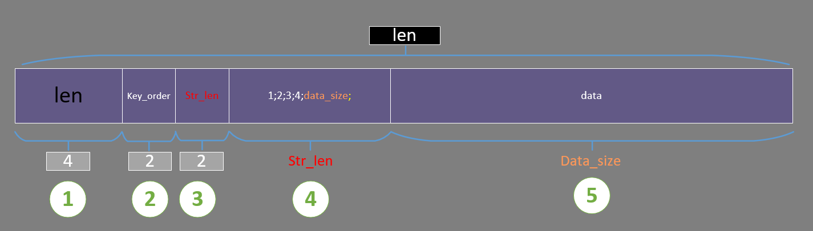

# Protocol
There are some parts about protocol.It uses various rules to ensure that the cloud image can be displayed on the local mobile phone normally.
## Common Protocol definition
path:vmic/cloud/include/congfig.h
There two ports to be used in protocol. one is the common stream and another is about video stream.
```c++
COMMON_PORT 50000
VIDEO_PORT 50001
```
in order to get the communication connection status. Protocol need to send an simple message by a fixed frequency. Unit is seconds.
```c++
HEART_RATE 1
```

Protocol set some names to make each stream. So protocol can distinguish which message is.
```c++
AUDIO_NAME "audio"
VIDEO_NAME "video"
TOUCH_NAME "touch"
SENSOR_NAME "sensor"
GPS_NAME "gps"
CAMERA_NAME "camera"
OPERATION_NAME "operation"
STATISTIC_NAME "Statistic"
MESSENGER_NAME "messenger"
SDK_CONTROL_ORI "messenger_ori"
OPERATOR_FILE_SYN "operator_file_sync"
SDK_COMMAND_STREAM "command"
NFC_NAME "nfc"
```

Protocol can auto set the log switch.
```c++
LOG_AGENT 1
LOG_COMMUNICATION 1 << 1
LOG_VIDEO 1 << 2
LOG_AUDIO 1 << 3
LOG_TOUCH 1 << 4
LOG_OPERATOR 1 << 5
```
if you want to open the Video and Audio log, you can do like following step:

 1. telnet 192.168.1.24 port
 2. debugLevel:6

port: if your start instance 3,the port is 60003.
6:2(1<<2)+4(1<<3)=6


Rotation constant: 0,90,180,270 degree rotation (natural orientation)
```c++
ROTATION_0 0
ROTATION_90 1
ROTATION_180 2
ROTATION_270 3
```
Protocol action map. it set the action what protocol should to do.
```c++
conn_common_port_first_user_attached = 101;
conn_common_port_multi_user_attached = 102;
conn_video_port_user_attached = 103;
conn_client_data_received = 104;
conn_client_dettached = 105;
conn_common_data_size_statistic = 106;
conn_video_data_size_statistic = 107;

operation_data_arrival = 121;
operation_audio_start = 122;
operation_audio_stop = 123;
operation_audio_pause = 124;
operation_audio_record_start = 125;
operation_audio_record_stop = 126;
operation_camera_open = 127;
operation_camera_close = 128;
operation_camera_start_preview = 129;
operation_camera_stop_preview = 130;
operation_file_download = 131;
operation_ori_changed = 132;

video_data_arrival = 141;

audio_data_arrival = 161;

other_data_arrival = 181;

file_rate_arrival = 201;

server_config_change = 221;

statistic_socket_close = 241;
statistic_data_arrival = 242;
```
## VmicAgent
It is the agent processing class on the server side of the entire cloud mobile phone protocol, which has the functions of controlling various engines, distributing data, and agent life cycle. The entrance to the entire agreement process starts here. It is also formed as a singleton in the process.
### function
```c++
VmicAgentCallBack(void* arg, uint8_t name, int command, uint8_t* data, int data_size)
```
arg:scalable parameter. protocol can use this to transfer everything.such as:pointer,variable,function pointer...

name:stream name

command:action

data & data_size:data

this function can be transfer every stream.Protocol allow each stream transfer data,action by this.

### Data dis/assemble
Protocol uses MsgFragment class to dis/assemble data. it defined a dis/assemble order like following struct.
```c++
struct commonAssembleFlag {
  int flagBit = 14;
  int type = 1;
  int typeStatus = 1 << 1;
  int config = 1 << 2;
  int dataStatus = 1 << 3;
  int custommsg1 = 1 << 4;
  int custommsg2 = 1 << 5;
  int custommsg3 = 1 << 6;
  int custommsg4 = 1 << 7;
  int custommsg5 = 1 << 8;
  int custommsg6 = 1 << 9;
  int custommsg7 = 1 << 10;
  int custommsg8 = 1 << 11;
  int name = 1 << 12;
  int dataSize = 1 << 13;
  int data = 1 << 14;
};
```
There are two elements to know a variable does. what's its name and what's its value. In other words,it can use this to represent which is key:value.Only in this way, when this parameter is passed to other places, it can play its role or be recognized what it is.However, when the variable name is too long and certain variables are fixed, a large number of such writing like this methods will cause a waste of memory.So,Protocol stipulates that the corresponding variables are taken and identified in order, that is, whenever there are fixed variables that need to transmit data, only their respective values are taken and arranged in order, separated by ";" , and named "key order".
The above is about variables,finally protocol generate a piece of data according to MsgFragment.like following:



The picture shows in detail the arrangement rules of the data after MsgFragment is converted to a piece of data.
The data consists of 5 parts.

 1. total size about the whole piece of data.
 2. Indicates whether the corresponding variable has a value
 3. The length of location where the variable value is saved
 4. The location where the variable value is saved
 5. Where to save big data