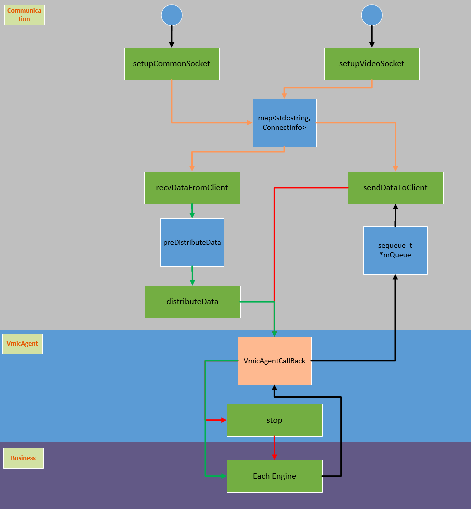

# Thread
The threading model of the entire protocol is a many-to-many model. This can be divided into two parts to explain one by one.

## protocolServer

All green rectangles in the figure show threads, which are used to process data or wake up adjacent threads. The blue rectangle is the queue, where the data storage information is recorded.

**setupCommonSocket**

It is used to continuously monitor port 50000 and store all censored TCP client connections from port 50000 into the queue.

**setupVideoSocket**

Like setupCommonSocket, it is responsible for monitoring 50001

**recvDataFromClient**

Both setupCommonSocket and setupVideoSocket will generate a TCP link, then recvDataFromClient is used to receive data from TCP.Each time the data received will be divided into portions and stored in the queue according to the rules of the protocol, and trigger distributeData to run.

**distributeData**

Its function is to send a copy of the data in the queue to the Agent, so that it can be sent to each business.

**sendDataToClient**

Its function is to send the data generated and transmitted by each A to the other end of the protocol