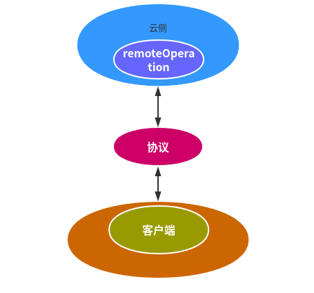
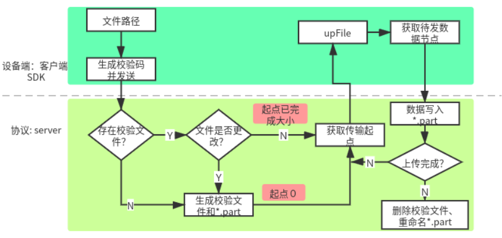
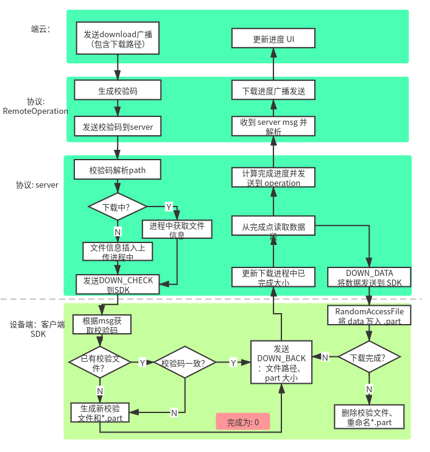

[TOC]

# 一、简介

协议各业务的实现是基于云手机某些功能必须依赖于设备手机的条件，才能得以实现，包括使用设备手机的通信能力以及数据信息。

为了让云端拥有更有效的行使能力，就需要一系列既定的协议来应对各种不同的问题和处理不同的事物。那么此模块就是来保证云端更好更快的运行。
首先通信双方都能清楚的知道对方所要表达的是什么，想要做什么；其次在保证沟通的前提下，尽可能让传输的数据小。

# 二、协议枢纽地位

协议做为云端和设备端数据的连接桥梁，在云手机中的地位不可或缺。下图体现了各部分之间的关系。




可见，云端和设备端所有的往来及通信必须经由协议。设备端的数据经由客户端发送给协议，最后最终到达云端；数据流是双向允许的，所以云端的数据将按与之相反的路径发送。

# 三、电话

由于电短联应用存在一个 SIM 卡检测的过程,　所以需要设备端 SIM 卡状态同步到云端。客户端实时获取 SIM 卡信息的同时，将获取信息发送到协议；协议将信息以需要的格式打包到广播中，发送到云端；云端按照插入 SIM 卡数据库需要的数据样式解析广播并更新数据库，从而实现云端 SIM 卡同步。

##  3. 1 电话拨打

电话拨打，行为产生于云端，而在设备端实现拨号功能。故属于云端向设备端发送数据。

1. 云端拨号将拨打号码及 SIM 卡选卡信息发送至协议

```
String number = getLogNumber(call);
final String TELEPHONE_CALL = "cmcc.intent.action.CALL";
Intent intent = new Intent(TELEPHONE_CALL);
intent.putExtra("phoneNumber", number);
intent.putExtra("slotId", slotId);
mContext.sendBroadcast(intent);
```

2. RemoteOperation 接收云端广播，协议发挥连接作用

 ```
public void onReceive(Context context, Intent intent) {
        String action = intent.getAction();
        List<Map<String, Object>> data = new ArrayList<>();
        String busType = "";
        if ( "cmcc.intent.action.CALL".equals(action)) {
                String number = intent.getStringExtra(Constants.Telephony.Call.KEY_PHONE_NUMBER);
                int slotId = intent.getIntExtra(Constants.Telephony.Call.KEY_EXTRA_SLOTID, -1);
                data.clear();
                Map<String, Object> map = new HashMap<>();
                busType = "Call";
                map.put(Constants.Telephony.Call.KEY_PHONE_NUMBER, number);
                map.put(Constants.Telephony.Call.KEY_EXTRA_SLOTID, slotId);
                data.add(map);
            }
        }
        try {
                CommonMessage commonMessage = new CommonMessage();
                commonMessage.setName(Constants.BusinessType.BUSINESS_TETEPHONY);
                commonMessage.setMessage(JsonUtils.toJson(data, busType));
                ……
                mService.sendOperationMsg(commonMessage.getName(), commonMessage.getMessage());
            } catch (Exception e) {
                e.printStackTrace();
            }
  }
```

可见 RemoteOperation 已成功将数据发送到协议 server 端。

3. 客户端接收 server 端数据，启用设备端拨号界面，执行拨号操作。

```
 // 解析server端发送的数据
    public void remoteData(String msg) {
        String busType = (String) JsonUtils.getValues(tempMap, Constants.KEY_BUSINESS_TYPE);
        Map<String, Object> tempMap = JsonUtils.fromJson(msg);
        List<Map<String, Object>> maps = (List<Map<String, Object>>) JsonUtils.getValues(tempMap, Constants.KEY_BUSINESS_DATA);

        switch (busType) {
            case Constants.Telephony.Call.TYPE: {
                int slotId = -1;
                Object number = JsonUtils.getValues(values, Constants.Telephony.Call.KEY_PHONE_NUMBER);
                if (number != null) {
                    phoneNumber = (String) number;
                }
                Object id = JsonUtils.getValues(values, Constants.Telephony.Call.KEY_EXTRA_SLOTID);
                if (id != null) {
                    slotId = (Integer) id;
                }
                MLog.d(TAG, "[Call]phoneNumber = " + phoneNumber + ",slotId = " + slotId);
                dialPhoneNumber(phoneNumber, slotId);
            }
        }
    }

 // 调用拨号intent
    private void dialPhoneNumber(String phoneNumber, int slot) {
        PhoneAccountHandle accountHandle = null;
        try {
            SubscriptionManager manager = SubscriptionManager.from(mContext);
            TelecomManager telecomManager = (TelecomManager) mContext.getSystemService(Context.TELECOM_SERVICE);
            List<PhoneAccountHandle> list = telecomManager.getCallCapablePhoneAccounts();
            for (PhoneAccountHandle handle : list) {
                SubscriptionInfo info = manager.getActiveSubscriptionInfoForSimSlotIndex(slot);
                if (info != null && TextUtils.equals(info.getIccId(), handle.getId())) {
                    accountHandle = handle;
                    break;
                }
            }
        } catch (Exception e) {
            e.printStackTrace();
        }

        Intent intent = new Intent(Intent.ACTION_CALL);
        intent.setFlags(FLAG_ACTIVITY_NEW_TASK);
        intent.setData(Uri.parse("tel:" + phoneNumber));
        if (accountHandle != null) {
            intent.putExtra(TelecomManager.EXTRA_PHONE_ACCOUNT_HANDLE, accountHandle);
        }
        if (intent.resolveActivity(mContext.getPackageManager()) != null) {
            mContext.startActivity(intent);
        }
    }    
```

## 3.2 通话记录同步

由电话拨打实现可知，电话拨打行为发生于设备端，因此通话记录必然产生于设备端，同步行为属于设备端向云端发送数据。

1. 客户端通过监听 ACTION_PHONE_STATE_CHANGED 获取设备通话记录，并发送到 server。

```
if (ACTION_PHONE_STATE_CHANGED.equals(action)) {
    TelephonyManager telephonyManager = (TelephonyManager) context.getSystemService(Service.TELEPHONY_SERVICE);
    int state = telephonyManager.getCallState();
    if (state == TelephonyManager.CALL_STATE_IDLE) {
      try {
                Thread.sleep(500);
            } catch (InterruptedException e) {
                e.printStackTrace();
            }
      getCallLogInfo(mContext);
    }
}

private void getCallLogInfo(Context context) {
    Cursor cursor = null;
    cursor = context.getContentResolver().query(CallLog.Calls.CONTENT_URI,
            new String[]{
                    CallLog.Calls.CACHED_NAME,
                    CallLog.Calls.NUMBER,
                    CallLog.Calls.TYPE,
                    CallLog.Calls.DATE,
                    CallLog.Calls.DURATION,
            }, CallLog.Calls.NUMBER + "= ?", new String[]{phoneNumber}, CallLog.Calls.DEFAULT_SORT_ORDER);

    if (cursor != null && cursor.moveToFirst()) {
      List<Map<String, Object>> data = new ArrayList<>();
      String callName = cursor.getString(0);
      String callNumber = cursor.getString(1);
      int callType = cursor.getInt(2);
      long callDate = cursor.getLong(3);
      int callDuration = cursor.getInt(4);

      Map<String, Object> map = new HashMap<>();
      map.put(Constants.Telephony.CallLogInfo.KEY_CALL_NAME, TextUtils.isEmpty(callName) ? callNumber : callName);
      map.put(Constants.Telephony.CallLogInfo.KEY_CALL_NUMBER, callNumber);
      map.put(Constants.Telephony.CallLogInfo.KEY_CALL_DATE, callDate);
      map.put(Constants.Telephony.CallLogInfo.KEY_CALL_TYPE, callType);
      map.put(Constants.Telephony.CallLogInfo.KEY_CALL_DURATION, callDuration);

      data.add(map);
      phoneNumber = "";
      CommonMSG callLogInfo = new CommonMSG.OperatorBusiness()
              .setName(BUSINESS_NAME)
              .setMsg(JsonUtils.toJson(data, Constants.Telephony.CallLogInfo.TYPE))
              .build();
      setDataToRemote(callLogInfo);
    }
  }
```

2. RemoteOperation 处理来自 server 端的通话记录数据，并通过广播发送到云端

 ```
 IVmicOperationListener.Stub operationListener = new IVmicOperationListener.Stub() {
        @Override
        public int onMessageArrival(String msg) {
            Map<String, Object> datas = JsonUtils.fromJson(msg);
            if (datas == null) {
                return 0;
            }
            String busType = (String) JsonUtils.getValues(datas, Constants.Common.KEY_BUSINESS_TYPE);
            switch (busType) {
                    ...
                    case Constants.Telephony.CallLogInfo.TYPE:
                        sendCallLogInfo(datas);
                        break;
                    ...
                }
        }
}

private void sendCallLogInfo(Map<String, Object> datas) {
        List<Map<String, Object>> data = (List<Map<String, Object>>) JsonUtils.getValues(datas, Constants.Common.KEY_BUSINESS_DATA);
        if (data == null) {
            return;
        }
        for (int i = 0; i < data.size(); i++) {
            Map<String, Object> stringObjectMap = data.get(i);
            String callName = (String) stringObjectMap.get(Constants.Telephony.CallLogInfo.KEY_CALL_NAME);
            String callNumber = (String) stringObjectMap.get(Constants.Telephony.CallLogInfo.KEY_CALL_NUMBER);
            long callDate = (long) stringObjectMap.get(Constants.Telephony.CallLogInfo.KEY_CALL_DATE);
            int callType = (int) stringObjectMap.get(Constants.Telephony.CallLogInfo.KEY_CALL_TYPE);
            int callDuration = (int) stringObjectMap.get(Constants.Telephony.CallLogInfo.KEY_CALL_DURATION);
            Log.d(TAG, "[TelephonyBus][sendCallLogInfo]callName:" + callName + ", callNumber:" + callNumber + ", callDate:"
                    + callDate + ", callType:" + callType + ", callDuration:" + callDuration);
            Intent intent = new Intent(Constants.Telephony.CallLogInfo.ACTION_CALL_LOG_CHANGE);
            intent.putExtra(Constants.Common.KEY_BUSINESS_TYPE, Constants.Telephony.CallLogInfo.TYPE);
            intent.putExtra(Constants.Telephony.CallLogInfo.KEY_CALL_NAME, callName);
            intent.putExtra(Constants.Telephony.CallLogInfo.KEY_CALL_NUMBER, callNumber);
            intent.putExtra(Constants.Telephony.CallLogInfo.KEY_CALL_DATE, callDate);
            intent.putExtra(Constants.Telephony.CallLogInfo.KEY_CALL_TYPE, callType);
            intent.putExtra(Constants.Telephony.CallLogInfo.KEY_CALL_DURATION, callDuration);
            mContext.sendBroadcast(intent);
        }
    }
 ```

3. 云端接收来自协议的广播，更新云端通话记录数据库，从而实现通话记录同步

 ```
 private final String CALL_LOG_ACTION = "cmcc.intent.action.CALL_LOG_CHANGE";
 private final String RECEIVE_TYPE = "CallLogInfo";
 private BroadcastReceiver mReceiver = new BroadcastReceiver() {
        @Override
        public void onReceive(Context context, Intent intent) {
            String action = intent.getAction();
            if (action != null && CALL_LOG_ACTION.equals(action)) {              
                  if (RECEIVE_TYPE.equals(intent.getStringExtra("busType"))) {
                    ...
                    ContentValues values = new ContentValues(1);
                    values.put(CallLog.Calls.DURATION, callDuration);
                    mContext.getContentResolver().update(callUri, values, "_id = ?",
                            new String[]{Integer.toString(last_call_id)});
                    ...
                  }
            }
        }
    };
  ```

# 四、短信

## 4.1 发送短信

发送短信，行为和拨打电话相似，同产生于云端，而在设备端实现，属于云端向设备端发送数据。

1. 云端短信相关数据发送至协议 RemoteOperation。

  ```
  final String SEND_MESSAGE = "cmcc.intent.action.SEND_MESSAGE";
  Intent intent = new Intent(SEND_MESSAGE);
  intent.putExtra("phoneNumber", dest);
  intent.putExtra("message", message);
  intent.putExtra("slotId", PhoneUtils.get(subId).getSimSlotIndex());
  context.sendBroadcast(intent);        
  ```

2. RemoteOperation 接收云端广播，将数据转换包裹后发送给 server。

```
if ( "cmcc.intent.action.SEND_MESSAGE".equals(action)) {
  String number = intent.getStringExtra(Constants.Telephony.Message.KEY_PHONE_NUMBER);
          int slotId = intent.getIntExtra(Constants.Telephony.Message.KEY_EXTRA_SLOTID, -1);
          String message = intent.getStringExtra(Constants.Telephony.Message.KEY_EXTRA_MESSAGE);
          data.clear();
          Map<String, Object> map = new HashMap<>();
          busType = Constants.Telephony.Message.TYPE;
          map.put(Constants.Telephony.Message.KEY_PHONE_NUMBER, number);
          map.put(Constants.Telephony.Message.KEY_EXTRA_SLOTID, slotId);
          map.put(Constants.Telephony.Message.KEY_EXTRA_MESSAGE, message);
          data.add(map);
    }
}
try {
        CommonMessage commonMessage = new CommonMessage();
        commonMessage.setName(Constants.BusinessType.BUSINESS_TETEPHONY);
        commonMessage.setMessage(JsonUtils.toJson(data, busType));
        ……
        mService.sendOperationMsg(commonMessage.getName(), commonMessage.getMessage());
    } catch (Exception e) {
        e.printStackTrace();
    }
```

3. 客户端接收 server 端数据，调用发送短信的 Intent。

```
case Constants.Telephony.Message.TYPE: {
  String phoneNumber = "";
  String message = "";
  int slotId = -1;
  Object number = JsonUtils.getValues(values, Constants.Telephony.Message.KEY_PHONE_NUMBER);
  phoneNumber = (String) number;
  Object messageString = JsonUtils.getValues(values, Constants.Telephony.Message.KEY_EXTRA_MESSAGE);
  message = (String) messageString;
  Object id = JsonUtils.getValues(values, Constants.Telephony.Message.KEY_EXTRA_SLOTID);
  slotId = (Integer) id;
  sendMessage(phoneNumber, message, slotId);
}

private void sendMessage(String phoneNumber, String message, int slot) {
  ...
  SmsManager smsManager = subId == SubscriptionManager.INVALID_SUBSCRIPTION_ID
                ? SmsManager.getDefault()
                : SmsManager.getSmsManagerForSubscriptionId(subId);

 if (smsManager != null) {
   ArrayList<String> msgs = smsManager.divideMessage(message);
   smsManager.sendMultipartTextMessage(phoneNumber, null, msgs, null, null);
 }
}                
```

## 4.2 发送记录同步

因为云端已经通过协议实现了 SIM 卡信息同步，所以在云端发送短信时，可正常执行短信数据库插入步骤。即云端发送短信时，已经完成发送记录存储，不需要依赖设备端返回记录来同步。

# 五、联系人同步

联系人同步以 .vcf 格式导出设备端联系人，以文件上传的方式发送到云端，然后在通讯录中完成联系人导入功能。文件上传下节将详细介绍其实现，此处仅详述联系人自动导入。

```
public static final String filePath = "/sdcard/Android/data/com.cloud.operation/File/contacts.vcf";
public static void doImportFromVcfFile(Activity activity) {
        File source = new File(filePath);
        if (source.exists()) {
            Uri uri = Uri.fromFile(source);
            Intent importIntent = new Intent(activity, ImportVCardActivity.class);
            importIntent.setAction(Intent.ACTION_VIEW);
            importIntent.putExtra(KEY_IMPORT_TYPE, IMPORT_CONTACTS_FROM_CLOUD_PHONE);
            importIntent.setData(uri);
            activity.startActivity(importIntent);
        }
}
public static void deleteContactVcf() {
        File source = new File(filePath);
        if (source.exists()) {
            source.delete();
        }
}
```

在通讯录应用启动时调用 doImportFromVcfFile() 实现来自设备的 .vcf 导入，导入成功后执行 deleteContactVcf() 将其删除，避免重复导入。

# 六、文件上传



上图可见文件上传针对断点续传引入了文件校验。实现中使用的是 md5 校验方式，保证断点续传文件的完整性以及与本地文件的一致性。断点续传协议 server 处理如下：

```
void FileEngine::fileDownLoadProcess() {
      ...
      downs->second.sendSize += downs->second.backSize;
      downs->second.backSize = -1;
      int needCopy = 0;
      char data[COPYSTEP];
      if ((needCopy = downs->second.totalSize - downs->second.sendSize) >=
          COPYSTEP) {
        needCopy = COPYSTEP;
      }
      downs->second.inStream->seekg(downs->second.sendSize, std::ios::beg);
      downs->second.inStream->read(data, needCopy);

      MsgReassemble *bmsg = new MsgReassemble();
      bmsg->setName(SDK_COMMAND_STREAM);
      bmsg->setType(FILE_SYNC);
      bmsg->setTypeStatus(DOWN_DATA);
      bmsg->setCustomMsg1(downs->second.file);
      bmsg->setData((uint8_t *)data, needCopy);
      uint8_t *assembleBuf = nullptr;
      size_t size = bmsg->assemble(&assembleBuf);
      mVmicCallback(nullptr, streamName::other, other_data_arrival, assembleBuf,
                    size);
}
```

校验文件涵盖了文件校验码，文件大小，文件路径，文件名称。具体生成实现如下：

```
   /**
     * Generate check string with the file md5 info.
     * If the file modified time update the md5 may be changed, so need to regenerate it
     * @param filePath   the file path is unique
     * @param fileName   the file name may be iterative
     */     
    public static String generateCheckCode(String filePath, String fileName) {
        File file = new File(filePath);
        if (!file.exists()) {
            return null;
        }

        String fileMd5 = null;
        long lastTime = new File(filePath).lastModified();
        if (mFileInfo.containsKey(filePath)) {
            long oldTime = (long) mFileInfo.get(filePath).get(0);
            String oldMd5 = (String) mFileInfo.get(filePath).get(1);
            if (lastTime == oldTime) {
                fileMd5 = oldMd5;
            }
        }
        if (fileMd5 == null) {
            fileMd5 = getFileMd5(file);
            ArrayList values = new ArrayList();
            values.add(lastTime);
            values.add(fileMd5);
            mFileInfo.put(filePath, values);
        }

        StringBuffer stringBuffer = new StringBuffer();
        stringBuffer.append("fileMd5:")
                .append(fileMd5)
                .append(",fileLength:")
                .append(file.length())
                .append(",filePath:")
                .append(filePath)
                .append(",fileName:")
                .append(fileName);
        return stringBuffer.toString();
   }

   //md5 校验码生成
   public static String getFileMd5(File file) {
        BigInteger bi = null;
        FileInputStream fis = null;
        try {
            byte[] buffer = new byte[8192];
            int len;
            MessageDigest md = MessageDigest.getInstance("MD5");
            fis = new FileInputStream(file);
            while ((len = fis.read(buffer)) != -1) {
                md.update(buffer, 0, len);
            }
            byte[] b = md.digest();
            bi = new BigInteger(1, b);
        } catch (NoSuchAlgorithmException e) {
            e.printStackTrace();
        } catch (IOException e) {
            e.printStackTrace();
        } finally {
            if (fis != null) {
                try {
                    fis.close();
                } catch (IOException e) {
                    e.printStackTrace();
                }
            }
        }
        if (bi != null) {
            return bi.toString(16);
        }
        return null;
  }
```

# 七、文件下载



从文件下载流程图可见，文件下载同样支持断点续传，所以每次下载执行时都会先校验再下载。校验算法和本地完成度获取方式和文件上传差异不大，此处不再赘述。
